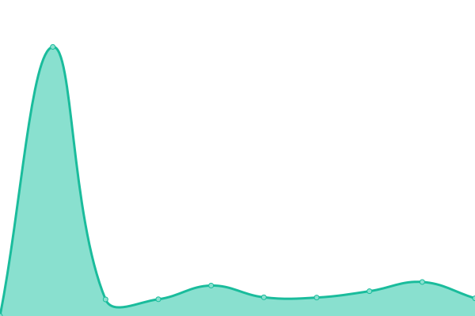
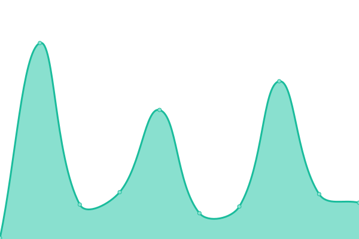
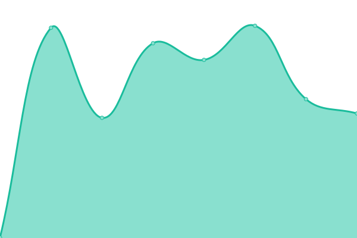
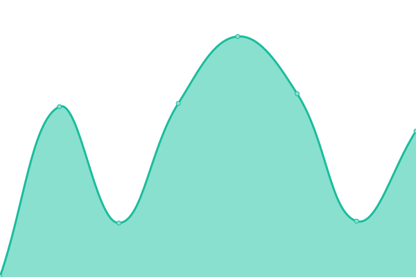

# [📈 Live Status](https://status.randomfandom.cf): <!--live status--> **🟩 All systems operational**

This repository contains the open-source uptime monitor and status page for [FanboyStudios](https://randomfandom.cf), powered by [Upptime](https://github.com/upptime/upptime).

With [Upptime](https://upptime.js.org), you can get your own unlimited and free uptime monitor and status page, powered entirely by a GitHub repository. We use [Issues](https://github.com/FanboyStudios/RFMG-Status-Monitor/issues) as incident reports, [Actions](https://github.com/FanboyStudios/RFMG-Status-Monitor/actions) as uptime monitors, and [Pages](https://status.randomfandom.cf) for the status page.

<!--start: status pages-->
<!-- This summary is generated by Upptime (https://github.com/upptime/upptime) -->
<!-- Do not edit this manually, your changes will be overwritten -->
<!-- prettier-ignore -->
| URL | Status | History | Response Time | Uptime |
| --- | ------ | ------- | ------------- | ------ |
|  [Random Fandom](https://randomfandom.cf) | 🟩 Up | [random-fandom.yml](https://github.com/FanboyStudios/RFMG-Status-Monitor/commits/HEAD/history/random-fandom.yml) | 

 432ms
     
 | 

<a href="https://status.randomfandom.cf/history/random-fandom">100.00%</a>
    

|  [Random Fandom Forum](https://forum.randomfandom.cf) | 🟩 Up | [random-fandom-forum.yml](https://github.com/FanboyStudios/RFMG-Status-Monitor/commits/HEAD/history/random-fandom-forum.yml) | 

 438ms
     
 | 

<a href="https://status.randomfandom.cf/history/random-fandom-forum">100.00%</a>
    

|  [Random Fandom Profiles](https:/randomfandom.cf/RFMG) | 🟩 Up | [random-fandom-profiles.yml](https://github.com/FanboyStudios/RFMG-Status-Monitor/commits/HEAD/history/random-fandom-profiles.yml) | 

 108ms
     
 | 

<a href="https://status.randomfandom.cf/history/random-fandom-profiles">100.00%</a>
    

|  [The Creators Advertiser Consumers Association](https://caca.randomfandom.cf) | 🟩 Up | [the-creators-advertiser-consumers-association.yml](https://github.com/FanboyStudios/RFMG-Status-Monitor/commits/HEAD/history/the-creators-advertiser-consumers-association.yml) | 

 412ms
     
 | 

<a href="https://status.randomfandom.cf/history/the-creators-advertiser-consumers-association">100.00%</a>
    

|  [The No Pay To Win Coalition](https://nop2wcoalition.ga) | 🟩 Up | [the-no-pay-to-win-coalition.yml](https://github.com/FanboyStudios/RFMG-Status-Monitor/commits/HEAD/history/the-no-pay-to-win-coalition.yml) | 

 472ms
     
 | 

<a href="https://status.randomfandom.cf/history/the-no-pay-to-win-coalition">100.00%</a>
    

|  [RCERC](https://rcerc.org) | 🟩 Up | [rcerc.yml](https://github.com/FanboyStudios/RFMG-Status-Monitor/commits/HEAD/history/rcerc.yml) | 

 325ms
     
 | 

<a href="https://status.randomfandom.cf/history/rcerc">100.00%</a>
    

|  [WBC](https://wadleybaptistchurch.cf) | 🟩 Up | [wbc.yml](https://github.com/FanboyStudios/RFMG-Status-Monitor/commits/HEAD/history/wbc.yml) | 

 449ms
     
 | 

<a href="https://status.randomfandom.cf/history/wbc">100.00%</a>
    

|  [Kekkocraft](https://kekkocraft.ga) | 🟩 Up | [kekkocraft.yml](https://github.com/FanboyStudios/RFMG-Status-Monitor/commits/HEAD/history/kekkocraft.yml) | 

 453ms
     
 | 

<a href="https://status.randomfandom.cf/history/kekkocraft">100.00%</a>
    

|  [Kekkocraft Me](https://kekkocraft.ga/me) | 🟩 Up | [kekkocraft-me.yml](https://github.com/FanboyStudios/RFMG-Status-Monitor/commits/HEAD/history/kekkocraft-me.yml) | 

 104ms
     
 | 

<a href="https://status.randomfandom.cf/history/kekkocraft-me">100.00%</a>
    

<!--end: status pages-->

[**Visit our status website →**](https://status.randomfandom.cf)

## 📄 License

- Powered by: [Upptime](https://github.com/upptime/upptime)
- Code: [MIT](./LICENSE) © [FanboyStudios](https://randomfandom.cf)
- Data in the `./history` directory: [Open Database License](https://opendatacommons.org/licenses/odbl/1-0/)
