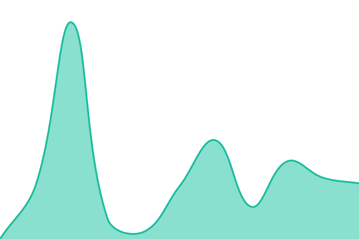
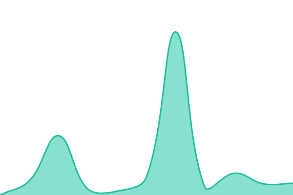
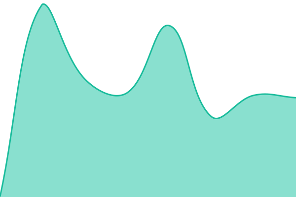
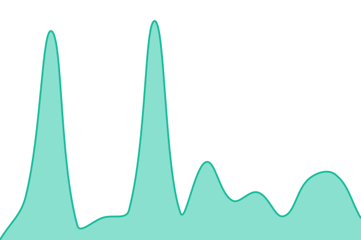
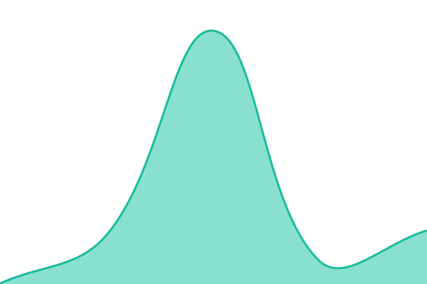

# [📈 Live Status](https://status.rfmg.top): <!--live status--> **🟧 Partial outage**

This repository contains the open-source uptime monitor and status page for [FanboyStudios](https://rfmg.top), powered by [Upptime](https://github.com/upptime/upptime).

With [Upptime](https://upptime.js.org), you can get your own unlimited and free uptime monitor and status page, powered entirely by a GitHub repository. We use [Issues](https://github.com/FanboyStudios/RFMG-Status-Monitor/issues) as incident reports, [Actions](https://github.com/FanboyStudios/RFMG-Status-Monitor/actions) as uptime monitors, and [Pages](https://status.rfmg.top) for the status page.

<!--start: status pages-->
<!-- This summary is generated by Upptime (https://github.com/upptime/upptime) -->
<!-- Do not edit this manually, your changes will be overwritten -->
<!-- prettier-ignore -->
| URL | Status | History | Response Time | Uptime |
| --- | ------ | ------- | ------------- | ------ |
|  [RFMG](https://rfmg.top) | 🟩 Up | [rfmg.yml](https://github.com/FanboyStudios/RFMG-Status-Monitor/commits/HEAD/history/rfmg.yml) | 

 525ms
     
 | 

<a href="https://status.rfmg.top/history/rfmg">91.77%</a>
    

|  [RFMG Forum](https://forum.rfmg.top) | 🟩 Up | [rfmg-forum.yml](https://github.com/FanboyStudios/RFMG-Status-Monitor/commits/HEAD/history/rfmg-forum.yml) | 

 1024ms
     
 | 

<a href="https://status.rfmg.top/history/rfmg-forum">91.86%</a>
    

|  [RFMG Profiles](https://rfmg.top/RFMG) | 🟩 Up | [rfmg-profiles.yml](https://github.com/FanboyStudios/RFMG-Status-Monitor/commits/HEAD/history/rfmg-profiles.yml) | 

 1129ms
     
 | 

<a href="https://status.rfmg.top/history/rfmg-profiles">91.93%</a>
    

|  [RFMG Shop](https:/shop.rfmg.top/) | 🟩 Up | [rfmg-shop.yml](https://github.com/FanboyStudios/RFMG-Status-Monitor/commits/HEAD/history/rfmg-shop.yml) | 

 303ms
     
 | 

<a href="https://status.rfmg.top/history/rfmg-shop">100.00%</a>
    

|  [The Advertisers, Creators, and Consumers Association](https://acca.rfmg.top/) | 🟥 Down | [the-advertisers-creators-and-consumers-association.yml](https://github.com/FanboyStudios/RFMG-Status-Monitor/commits/HEAD/history/the-advertisers-creators-and-consumers-association.yml) | 

 402ms
     
 | 

<a href="https://status.rfmg.top/history/the-advertisers-creators-and-consumers-association">0.10%</a>
    

|  [The No Pay To Win Coalition](https://nop2wc.rfmg.top/) | 🟩 Up | [the-no-pay-to-win-coalition.yml](https://github.com/FanboyStudios/RFMG-Status-Monitor/commits/HEAD/history/the-no-pay-to-win-coalition.yml) | 

 338ms
     
 | 

<a href="https://status.rfmg.top/history/the-no-pay-to-win-coalition">92.01%</a>
    

|  [RCERC](https://rcerc.org/) | 🟩 Up | [rcerc.yml](https://github.com/FanboyStudios/RFMG-Status-Monitor/commits/HEAD/history/rcerc.yml) | 

 182ms
     
 | 

<a href="https://status.rfmg.top/history/rcerc">12.81%</a>
    

|  [RCERC Forum](https://forum.rcerc.org/) | 🟩 Up | [rcerc-forum.yml](https://github.com/FanboyStudios/RFMG-Status-Monitor/commits/HEAD/history/rcerc-forum.yml) | 

 227ms
     
 | 

<a href="https://status.rfmg.top/history/rcerc-forum">12.77%</a>
    

<!--end: status pages-->

[**Visit our status website →**](https://status.rfmg.top)

## 📄 License

- Powered by: [Upptime](https://github.com/upptime/upptime)
- Code: [MIT](./LICENSE) © [Anand Chowdhary](https://anandchowdhary.com)
- Data in the `./history` directory: [Open Database License](https://opendatacommons.org/licenses/odbl/1-0/)
